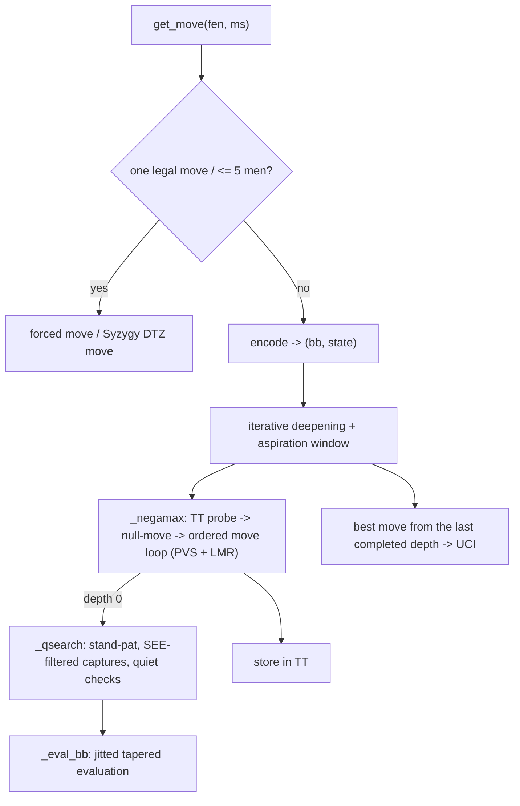

# ScholarsMate

Our agent for [AI Chessathon](https://aichessathon.com). A classical chess engine, no
network — a numba-jitted bitboard search with a hand-crafted evaluation. Team repo for
[Vonoa](https://github.com/Vonoa/aichessathon); forked from the official starter, which
still supplies the local harness (`harness/`, mirrors the platform's protocol and clock).

- **[docs/ENGINE.md](docs/ENGINE.md)** — how every technique works, and the maths. The
  finals-walkthrough reference.
- **[docs/PLAN.md](docs/PLAN.md)** — roadmap, status, what's next.
- **[PROGRESS.md](PROGRESS.md)** — the build log, newest entry last.
- **[docs/phase7-nnue.md](docs/phase7-nnue.md)** — the separate offline NNUE track.

## What it is

The deliverable is `agent.py` (`get_move(fen, time_left_ms) -> str`), plus the modules it
imports and a `syzygy/` folder of tablebase data. Everything runs in one process on one
core, 2 GB, ~120 s per game; numba compiles the hot paths to machine code during the 90 s
import budget.

| Layer | File | What |
|---|---|---|
| Board | `movegen.py` | Jitted bitboard move generator, make/unmake, Zobrist keys, SEE. `(bb, state)` numpy arrays — no `chess.Board` in the search. Perft-validated to depth 5 on the standard positions and against python-chess over 21k positions. |
| Search | `search.py` | Negamax + fail-soft alpha-beta, iterative deepening, principal variation search, aspiration windows, null-move pruning, late-move reductions, SEE quiescence filter, quiescence with a ply of quiet checks, killers + history, check extension, contempt, a persistent 64 MB transposition table, and a per-move time budget. |
| Eval | `evaluate.py` | Jitted tapered piece-square tables + material + pawn structure + mobility + non-linear king safety + KX-vs-K mop-up + endgame king activity. Pinned to a pure-Python reference by tests. |
| Endgame | `syzygy/` | 3-man Syzygy WDL+DTZ. At ≤5 men, `search_move` returns the tablebase move and skips the search. |

Reaches depth 6–8 in the middlegame at ~48k nodes/sec on the match machine. Deterministic:
no RNG in the search, fixed-seed Zobrist tables, stable-sort move ordering — the same
position and clock always produce the same move.

## The search, at a glance



## Build and run

```
make setup                                          # uv sync
make play                                           # one game vs a baseline, real time control
make arena                                          # 16 fast games, prints a score + interval
make bench                                          # nodes/sec + depth on three fixed positions
make gate                                           # ruff + mypy strict + pytest
make zip                                            # build submission.zip (includes syzygy/) and smoke it
```

Direct forms:

```
uv run python -m harness.play --white . --black baselines/minimax --pgn game.pgn
uv run python -m harness.arena --agent . --opponent versions/phase5jit --games 16
uv run python -m harness.package --include syzygy
```

`make arena` / `harness.arena` compares against a frozen previous version (`versions/*`),
which is the only signal that counts — a 16-game score has a wide interval, so read it
with the `+-` it prints. Every rated game also leaves a log on the dashboard beside the
PGN, keeping the first and last 4 KB of our stderr (the `[NcolourN] uci dN score ...` move
lines and the import time).

## Rules we build against

Classical engine we wrote; numba JIT (source compiled in-process, not a shipped binary);
Syzygy tablebases as shipped data under the 50 MB cap. **No** third-party engine, port or
translation; **no** shipped database of another engine's moves; **no** obfuscation.
`docs/PLAN.md` keeps the full list and `PROGRESS.md` the build history, for the retroactive
verification and the finals panel.
