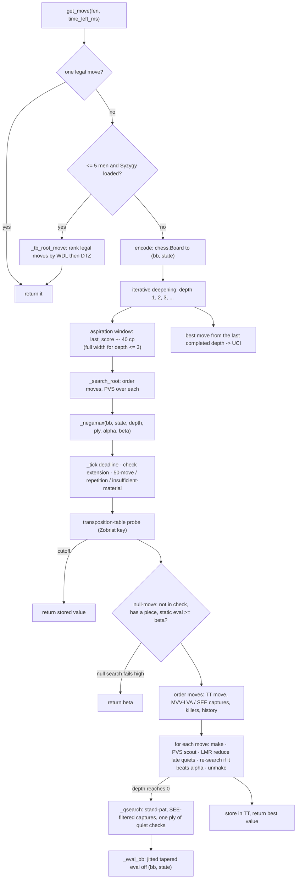

# How the engine works — the maths and the ideas

Reference for the team and the finals walkthrough. Covers every technique in `movegen.py`,
`search.py` and `evaluate.py` and why it is there. Companion to
[PROGRESS.md](../PROGRESS.md) (history), [PLAN.md](PLAN.md) (what's next), and
[phase7-nnue.md](phase7-nnue.md) (the NNUE track).

Current as of build `diag-9`: a **numba-jitted bitboard engine** — jitted move generator,
make/unmake and evaluation, negamax with the full classical pruning stack (persistent
transposition table, principal variation search, aspiration windows, null-move pruning,
late-move reductions, static exchange evaluation, killers/history, check extension,
quiescence with a ply of quiet checks) and 3-man Syzygy. ~48k nodes/sec, depth 6–8 in the
middlegame on the match machine.

---

## The search at a glance



---

## 1. The setting

`get_move(fen, time_left_ms) -> str`. One core, 2 GB, ~120 s for the whole game. numba
compiles the hot Python to machine code at import (inside the 90 s init budget), so node
counts are in the **tens of thousands per move** — still far short of the millions a C
engine gets, so evaluation quality and move ordering earn their keep, but enough depth
(6–8 plies) that the pruning stack now pays.

A "node" = one position the search looks at. "Ply" = one half-move. "Depth" = how many
plies ahead the main line looks before the evaluation is called.

---

## 2. The board — jitted bitboards (`movegen.py`)

The search never touches a `chess.Board` — that is a correctness library, ~30–50 µs per
`legal_moves` + `push` / `pop`. Instead it carries a compact representation numba can
operate on:

```
bb     uint64[2, 6]  -- bb[colour, piece_type-1] bitboard; colour 0 = White, 1 = Black
state  int64[4]      -- [turn, castling (4 bits KQkq), ep_square (-1 if none), halfmove]
```

A move is packed into an `int32`: `from | to<<6 | promo<<12 | flag<<15`, where `flag`
distinguishes a normal move, a double pawn push, an en-passant capture and castling.

The jitted routines:

| routine | does |
|---|---|
| `_gen` | pseudo-legal moves into a fixed buffer, one `_MBUF` row per recursion ply |
| `_gen_legal` | `_gen`, then for each move make / test own king not attacked / unmake |
| `_make` / `_unmake` | apply / reverse a move in place; `_make` returns an undo word |
| `_attacked_by` | is a square attacked, given an occupancy (for check + castling + SEE) |
| `_zobrist` | a 64-bit position key (Section 6), from `(bb, state)` |
| `_see` | static exchange evaluation of a capture (Section 4) |

`chess.Board` survives only at the root of `search_move` — to parse the FEN, probe Syzygy,
and turn the chosen move code back into a UCI string.

**Correctness is not negotiable** (an illegal move loses the game). The generator is
validated by `perft` — count leaf nodes to a fixed depth — against the published numbers
for the six standard test positions to depth 5, *and* against python-chess's own
`legal_moves` count over 21,307 positions from 600 pseudo-random games, with zero
mismatches. The wired-in search then matches the old python-chess search's score on
561 / 562 positions at a fixed depth.

**Why it is not a third-party engine.** The bitboard move-generation, make/unmake and SEE
are our own code, written from the standard published algorithm. python-chess's public
attack-lookup tables (`chess.BB_KNIGHT_ATTACKS`, `BB_RANK_ATTACKS`, …) — a sanctioned
library, in the platform's base image — are read directly; nothing is ported or
translated from Stockfish, Lc0 or any engine.

---

## 3. Negamax

Minimax says White maximises the score, Black minimises it — two mirror-image code paths.
**Negamax** collapses them into one using the identity

```
min(a, b)  =  -max(-a, -b)
```

Score every position **from the point of view of the side to move**. Then whatever is good
for me is exactly `-1 x` as good for my opponent, so one function handles both sides:

```
value(node) = max over legal moves m of  -value(child after m)
```

The `-` in front of the recursive call is the whole trick: after you play `m` it is the
opponent's turn, the child returns a score in *their* frame, and negating it puts it back
in yours. `evaluate()` commits to the same convention (`return score if white_to_move else
-score`), so signs stay consistent from leaf to root automatically.

---

## 4. Alpha-beta pruning

Plain minimax visits `b^d` nodes, where `b` is the branching factor (~35 legal moves in a
middlegame) and `d` is the depth. Alpha-beta carries two bounds down the tree:

- **alpha** — the best score the side to move has already guaranteed somewhere else. A
  floor worth beating.
- **beta** — the best the opponent will allow (it is `-alpha` of the parent, because the
  opponent's floor is this node's ceiling).

If a move returns `value >= beta`, the opponent has a cheaper alternative one ply up and
will never enter this line, so you stop searching the siblings — a **beta cutoff**.

With **perfectly ordered** moves alpha-beta visits about `b^(d/2)` nodes — the square root.
Roughly: you need one good reply to refute a line, and good ordering finds it first, so
most subtrees collapse to a single child. In practice this doubles the reachable depth for
the same node budget. Ordering quality is therefore everything — hence section 5.

Our version is **fail-soft**: it returns the true best value found even when it is outside
the `[alpha, beta]` window, which gives the transposition table tighter bounds to store.

---

## 5. Move ordering

Alpha-beta only pays off if the best move is tried first. `_ordered` scores each move code
and sorts descending; the bands (all constants from `search.py`):

**Captures / promotions** — `_CAPTURE_BASE + 8*victim - attacker (+ promo bonus)`. This is
**MVV-LVA** (Most Valuable Victim, Least Valuable Attacker): `victim` and `attacker` are
piece-type ordinals 1..6 (pawn..king), read off `bb` with a small loop. Multiplying the
victim by 8 guarantees a bigger victim always outranks a smaller one regardless of
attacker (max attacker 6 < 8), and subtracting the attacker prefers taking with the
cheapest piece. "Pawn takes queen" beats "queen takes queen" beats "pawn takes knight".

**Killer moves** — two slots per ply (move codes, `0` = empty). A *quiet* move that caused
a beta cutoff at one node is very often good at a sibling (same tactical motif), so it is
tried right after the captures.

**History heuristic** — a `64 x 64` table indexed `from * 64 + to`. Every time a quiet
move causes a cutoff we add `depth * depth` to its cell; the `depth^2` weight makes a deep
cutoff count far more than a shallow one. Remaining quiet moves are ordered by this score.

The transposition-table move (section 7), if any, is spliced to the very front after the
sort. In quiescence a small number of non-capturing checking moves are appended after the
captures (section 8).

Killers and history reset every move. Captures are also **SEE-ordered where it matters**:
quiescence drops a capture whose static exchange evaluation (`movegen._see`) is worse than
`-_SEE_QS_MARGIN`, unless it takes an equal-or-bigger piece (structurally safe) or gives
check. `_see` resolves the capture sequence on the target square, least-valuable attacker
first, with x-ray attackers revealed as pieces leave — so `RxN` defended by a pawn is
recognised as losing and not searched.

---

## 6. Iterative deepening

Instead of picking a depth and searching once, search depth 1, then throw it away and
search depth 2, then 3, ... until the time budget for this move runs out.

**Why the re-search is nearly free.** Tree size grows geometrically. If depth `d` costs
`c * r^d` nodes for some ratio `r > 1`, then all the shallower passes together cost

```
c(r + r^2 + ... + r^(d-1))  =  c * r^d * (1/r + 1/r^2 + ...)  ~  c * r^d / (r - 1)
```

so the overhead over just searching depth `d` once is a *constant fraction*, about
`1/(r-1)` — typically 30-60%, not a multiple.

**What you buy for that fraction:**
1. Always a finished answer. If time runs out mid-pass you return the best move from the
   last *completed* depth — you never flag with nothing.
2. Free move ordering. Depth `d`'s best move is almost always still best at depth `d+1`, so
   you try it first and alpha-beta prunes `d+1` far harder. Iterative deepening usually
   pays for its own overhead this way.

**Aspiration windows.** Past depth 3, instead of searching `(-inf, +inf)` we open the
window at `last_score ± _ASPIRATION` (40 cp). A search that stays inside gets far more
cutoffs — the tighter beta refutes bad lines sooner. If the true score falls outside,
`_aspiration_search` widens that side to infinity and re-searches once (at most two
searches per depth), and the persistent TT (section 7) makes that re-search cheap
because the whole tree is still cached.

---

## 7. Transposition table

Different move orders reach the same position ("transpose"): `1.e4 e5 2.Nf3` and
`1.Nf3 e5 2.e4` are identical. Without a cache the search explores that subtree twice.

**The table is persistent and fixed-size** — kept across moves within a game (a fresh
process per game resets it for free). It is two flat `uint64` numpy arrays of `2^22`
(~4.2 M) slots, ~64 MB, allocated once at import: `_tt_key` holds the position's **Zobrist
key** (`movegen._zobrist(bb, state)` — piece/square random words XOR-ed together with
castling, en-passant and side-to-move terms; 0 marks an empty slot), and `_tt_data` packs
one entry into 64 bits — value (16), depth (8), bound flag (2), best-move code (15), and a
16-bit **generation** stamp. Open-addressed: `slot = key & mask`, one probe. An unbounded
dict here would churn GC and eat the 2 GB (the crowd's mistake). The Zobrist tables are
seeded from a fixed constant so the key — and therefore every move — is reproducible.

`search_move` bumps `_tt_gen` each move instead of clearing. On a store, a slot is
overwritten if it is empty, holds a different position, is from an older generation, or
holds a shallower result for this position — **replace-by-depth within a generation,
always-replace across generations**. This is what makes it safe to keep entries for a
whole game: a stale-generation entry (which may carry a path-dependent repetition draw
score) is refreshed within a move or two.

**Bound kinds** — a fail-soft alpha-beta value is not always exact:
- `_EXACT` — the search completed inside the window; `value` is the true score.
- `_LOWER` — a beta cutoff happened; the true score is `>= value` (a floor).
- `_UPPER` — no move beat alpha; the true score is `<= value` (a ceiling).

**Repetition detection** uses the same key: `_negamax` writes its key into `_PATH[ply]` as
it descends, and a node whose key already appears higher in `_PATH` — or in `_seen` (the
Zobrist keys of positions the game has actually visited, passed in by `agent.py`) — scores
as a draw. The Zobrist key changes on every capture and pawn move, so a position before an
irreversible move can never be mistaken for one after it.

On entering a node, if the slot holds this position (`_tt_key[slot] == key`) and was
searched at least as deep as we need (`e_depth >= depth`):
- `_EXACT` -> return it.
- `_LOWER` and `value >= beta` -> return it (already good enough to cut).
- `_UPPER` and `value <= alpha` -> return it (already too weak to matter).

Otherwise the stored `best_move` is still used as the first move to try.

**Not stored:** any value with `abs(value) >= _TT_VALUE_MAX` (30,000). That one check
covers both mate scores (root-relative, section 9) and any score too large for the
16-bit field. Repetition / already-seen draws return before the store is reached, so
they are never cached directly; a value merely *derived* from a repetition deeper down
is path-dependent but the generation stamp ages it out (contempt bounds the error to
±25).

---

## 8. Quiescence search and the horizon effect

If you stop the search at a fixed depth and evaluate, you often stop **in the middle of an
exchange** — "I'm up a queen!" one ply before the recapture. The evaluation is measured in
a position it was never designed for and is wrong. This is the *horizon effect*.

**Quiescence search** (`_qsearch`): at the horizon, instead of evaluating immediately, keep
searching **captures and promotions** (plus all legal moves when in check, since being in
check is not "quiet") until no forcing move remains, then evaluate.

- **Stand-pat**: the side to move can usually do at least as well as the static score by
  *not* capturing, so `stand_pat = evaluate(board)` is a lower bound. If `stand_pat >= beta`
  we cut immediately; if `stand_pat > alpha` it raises alpha.
- **One ply of quiet checks.** For the first `_QS_CHECK_PLIES` (1) plies past the horizon,
  when not in check, up to `_QS_CHECK_CAP` (6) non-capturing checking moves are appended
  to the capture list. This catches the forcing shot — a knight fork with check, a
  back-rank skewer — that a captures-only quiescence walks straight past. It can only
  raise the score (a bad check just scores low and is ignored), so stand-pat stays sound.
- **SEE filter** — a non-promotion capture is dropped unless it takes an equal-or-bigger
  piece, its `movegen._see` is `>= -_SEE_QS_MARGIN` (90 cp), or it gives check. Cuts the
  losing-capture subtrees a captures-only quiescence wastes time on (Section 5).
- It **terminates** because material runs out (capture chains are short) and the check
  window closes after one ply.
- A `_QS_MAX_PLY` cap is a safety net against pathological check/capture loops.
- **Not done:** delta pruning (skip a capture whose best-case material gain still leaves
  `stand_pat + gain + margin < alpha`).

---

## 9. Mate scores

A checkmate for the side to move (no legal moves, in check) is scored `-MATE + ply`, where
`ply` is the distance from the search root and `MATE = 1,000,000`.

- Subtracting `ply` makes a **faster mate score higher** (mate in 1 beats mate in 5), and
  makes the losing side **prefer the longest defence**.
- Scores past `_MATE_THRESHOLD = MATE - 1000` are recognised as forced mates: iterative
  deepening stops (a deeper search cannot beat a forced mate) and they are never stored in
  the transposition table (the `ply` offset is only correct relative to *this* root).
- `MATE` sits far above any material sum (~4000 cp), so a mate score can never be confused
  with a material score.

---

## 10. Contempt

A draw is scored `_CONTEMPT = 25` centipawns **below equal, from the root side's point of
view**, so the engine only accepts a draw when it genuinely believes it is worse by more
than a quarter of a pawn — it plays for the win.

The sign has to survive negamax's per-ply negation. `_draw_score(ply)` returns
`-_CONTEMPT` when `ply` is even (root side to move) and `+_CONTEMPT` when odd. Because a
given position always recurs at the **same ply parity** (side to move alternates with ply),
this is path-consistent: propagate a draw score up the tree and every node sees "a draw is
`_CONTEMPT` worse for the root side", which is what we want.

---

## 11. Search extensions, reductions, and pruning

**Principal variation search (PVS).** After the first move at a node is searched with the
full `(alpha, beta)` window, every later move is first scouted with a **null window**
`(-alpha-1, -alpha)` — a yes/no question, "does this beat what we already have?" A null
window prunes far harder. Only if the scout comes back `> alpha` (and, for an unreduced
move, `< beta`) do we re-search it with the full window for its exact value. Most later
moves fail the scout and cost one cheap search instead of two. Applied at the root
(`_search_root`) and every interior node (`_negamax`).

**Check extension.** When a node is in check, `depth += 1` before recursing — a forcing
line gets a full extra ply to resolve before evaluation, so short tactical shots are not
cut off by the horizon.

**Null-move pruning (NMP).** If we can pass and *still* be so far ahead the opponent
cannot claw back within a shallow search, this node is not worth a full one. Not in check,
`depth >= _NMP_MIN_DEPTH`, beta not a mate score, the side to move has a piece (not a
king-and-pawns position — passing can be forced-best there, *zugzwang*), and the static
eval is **already `>= beta`** (without this gate the null search is pure overhead in every
equal-or-worse position). Flip the side to move, clear en-passant, search `depth - 1 - r`
(`r` = 3 at depth ≥ 6, else 2) with a null window at beta; a fail-high prunes the node.
It only started paying once the jitted board pushed the middlegame to depth 6–8, where the
`r = 3` reduction compounds.

**Late-move reductions (LMR).** Moves ordered late are probably bad. For a *quiet* move
past `_LMR_MIN_MOVE`, at `depth >= _LMR_MIN_DEPTH`, not in or giving check, the null-window
scout runs at `depth - 1 - r` (`r` = 1, or 2 for very late moves). If that reduced scout
still beats alpha it "surprised" us, so re-search it at full depth.

**Not done:** reverse-futility / futility / late-move (move-count) pruning (all cheap on
the jitted substrate — `docs/PLAN.md`), delta pruning in quiescence, singular extensions.

---

## 12. Time management

**Per-move budget** (`_budget_s`):

```
moves_left = max(30, 56 - fullmove_number)
budget     = time_left_ms / moves_left + 0.5 * increment_ms
budget     = min(budget, time_left_ms / 3, time_left_ms - 500)     # cap + reserve
budget     = max(budget, 10 ms)                                     # floor
```

`time_left_ms / moves_left` is the sustainable share of the clock. Adding half the
increment reflects that every move refills the clock, so the increment is time to spend
rather than hoard. Assume at least 30 moves left so we do not drain the clock in a long
game. Never spend more than a third of the clock on one move, and always keep 500 ms —
the referee's watchdog does not forgive.

**Why it survives a long game.** If we always spend `T/m + i/2` and get `i` back per move,
then `T_next = T - (T/m + i/2) + i = T(1 - 1/m) + i/2`. The fixed point is
`T* = (i/2) * m = m*i/2`; with `m = 30`, `i = 500 ms` that is a stable ~7.5 s reserve, not
the ~2 s the earlier `m = 20`, no-cap formula converged to.

**Inferring the increment.** `get_move` is not told the increment. But after our move the
clock goes `new = old - our_spend + increment`, so

```
increment ~= new_clock - (old_clock - our_spend)
```

`agent.py` stores `old_clock` and measures `our_spend` with `time.monotonic()` around the
search, then backs the increment out, clamped to `[0, 2000] ms`, default 0 until the second
move. Our own timer runs a hair short of the referee's, which biases the estimate low — the
safe direction (smaller increment -> smaller budget).

**Clock checks inside the search.** `_tick` bumps a node counter and, once every
`_CHECK_INTERVAL` nodes, checks `time.monotonic()` against the deadline and raises
`_Timeout`, which unwinds to `search_move` and returns the last completed depth's move.

---

## 13. Endgame tablebases (Syzygy)

For positions with very few pieces the search is replaced by a lookup. `search.py` opens
whatever `.rtbw` / `.rtbz` files sit in `syzygy/` at import (wrapped so a missing or bad
folder just disables the feature). We ship the **3-man** set (K+P/Q/R/B/N vs K, ~26 KB).

When `search_move` is handed a position with `<= _TB_MAX_PIECES` (5) men and the tables
are loaded, `_tb_root_move` decides the move directly and the search never runs:

- For each legal move, probe **WDL** (win / draw / loss, respecting the 50-move rule) and
  **DTZ** (distance to zeroing — plies until the next capture, pawn move, or mate) from
  our point of view.
- Rank by best WDL first. Among those: when winning, prefer an immediate mate, then a
  move that resets the fifty-move counter, then the smallest DTZ (fastest conversion);
  when losing, the largest `|DTZ|` (drag it out) and keep the counter running; a draw
  just holds.

WDL alone is not enough — every move in a won K+R-vs-K keeps the win, so a WDL-only
search with the mop-up gradient (section 14.6) just orbits the lone king without mating.
DTZ is the ordering that actually converges: it mates K+R-vs-K in 27 plies, K+Q-vs-K in
11, and correctly *holds* a drawn K+P-vs-K.

The package step must be told to bundle the folder (`--include syzygy` / `make zip`), or
the tables do not ship and the engine silently falls back to searching.

## 14. Evaluation — `evaluate.py`

Returns a centipawn score (1 pawn = 100) from the **side-to-move's** point of view.

### 14.1 Material

`P=100  N=320  B=330  R=500  Q=900`, king 0 (its value is handled by mate detection). Bishop
slightly above knight is a crude bishop-pair proxy. Counted with `int.bit_count()` on the
piece bitboards masked by colour — no per-square Python loop.

### 14.2 Piece-square tables

A `[64]` table per piece giving a centipawn bonus for that piece on that square (knights
toward the centre, rooks toward open files and the 7th, a midgame king in the corner, an
endgame king central). Values are the public **PeSTO** tables — a standard positional
heuristic, not a third-party engine.

Squares are indexed `a1 = 0 ... h8 = 63` (python-chess). A white piece on `sq` reads
`table[sq]`; a black piece reads `table[sq ^ 56]` — XOR by 56 flips the rank (`a1 <-> a8`),
mirroring the board so the same table serves both colours. Black's contribution is
subtracted. (The PeSTO arrays are written rank-8-first, so they are flipped once at import
by `_flip_ranks` to match `a1 = 0` — getting this wrong made the midgame king want to march
up the board.)

### 14.3 Tapered evaluation

A queen matters differently in a queenless endgame; the king wants opposite things in the
middlegame and the endgame. So every square-dependent term has a **midgame** and an
**endgame** value, and the final score interpolates between them by *how much material is
left*.

**Game phase**: `phase = 1*N + 1*B + 2*R + 4*Q` summed over both sides, clamped to `[0, 24]`.
24 = full non-pawn material (pure midgame), 0 = bare kings (pure endgame).

**Blend**:

```
score = ( mg_score * phase  +  eg_score * (24 - phase) ) / 24
```

with `int(.../24)` (truncate toward zero) rather than `//` (which rounds toward negative
infinity and would make a position and its colour-mirror differ by 1 cp).

### 14.4 Pawn structure

Per side, in centipawns:
- **Doubled** — `-12` per extra pawn on a file (two pawns on the e-file = one penalty).
- **Isolated** — `-10` per pawn on a file with no friendly pawn on either adjacent file
  (no pawn can ever defend it).
- **Passed** — a bonus by rank (`0, 5, 10, 20, 35, 60, 100, 0` from the pawn's own side) if
  no enemy pawn stands on the same or an adjacent file ahead of it — nothing can stop it
  promoting except pieces.

### 14.5 Mobility

For each knight, bishop, rook, queen: count the squares it attacks (jitted ray walk) and
multiply by a small weight (a few cp per square, slightly higher in the endgame). A crude
"active pieces are worth more" term. The weights (4 cp/square for a minor) are low enough
that a boxed-in bishop is only ~20 cp worse than a free one — probably too weak to steer a
move choice; the deeper search from the jitted board is what actually catches trapped-piece
lines like Rated 67.

### 14.6 King safety (midgame only, phase-faded)

Computed on the `mg_score` side only, because an exposed king is a middlegame liability
but in the endgame the king is *supposed* to walk into the open. The phase blend fades it
to exactly nothing at `phase = 0`.

- **Pawn shield** — `+12` per friendly pawn on the three files in front of the king.
- **Open / half-open file** near the king — `-22` if neither side has a pawn on a file
  beside the king, `-12` if only the enemy does.
- **Non-linear attacker zone.** Sum `unit x (king-zone squares the piece attacks)` over
  every enemy piece bearing on the king's 3x3 zone (`unit`: P 2, N 3, B 3, R 5, Q 7), and
  count how many pieces contribute. With **0 or 1** attacker the penalty is just
  `-danger` (a lone piece is easily met). With **2 or more** it is
  `-min(450, danger^2 x 65 / 100)` — quadratic in the pile-up, capped near a rook. This
  is the real "an attack is worth more than the sum of its parts" shape. A parked
  `king-safety-v2` branch adds missing-flight-square and off-back-rank terms; it did not
  fix the Greek-gift losses (those are a horizon problem — the mating pieces arrive after
  the leaf) so it is held.

### 14.7 Endgame drivers — mop-up and king activity

Two small white-relative terms added *after* the tapered blend:

- **Mop-up** (`_mopup`) — active only when exactly one side is a bare king. Pushes the
  lone king toward a corner (`16 x` its centre-Manhattan distance) and marches the
  winning king in (`8 x (7 - Chebyshev(kings))`). A gradient to convert K+X-vs-K by, not
  a material term. (Below <=3 men Syzygy takes over entirely, section 13.)
- **King activity** (`_king_activity`) — when game phase `< 8`, one side leads by `>= 200`
  cp, and the trailing side is not a bare king: reward the leader for closing its king on
  the enemy king, faded to 0 at the phase ceiling. Turns aimless endgame shuffling into
  progress.

### 14.8 The weights are placeholders

Every number above is a hand-picked or public starting value, not tuned for *our* search.
The real gain is **Texel tuning**: play a few hundred thousand self-play positions, label
each with the eventual game result (1 / 0.5 / 0), and fit the weights by logistic
regression so `sigmoid(k * eval)` best predicts the result. `evaluate.py` keeps a
pure-Python `_evaluate_reference` specifically to tune against; the jitted path reads the
same tables. Overlaps the teammate's NNUE data work — see `docs/phase7-nnue.md`.

---

## 15. Bit tricks used throughout

A **bitboard** is a 64-bit integer, one bit per square (bit `i` = square `i`, `a1 = 0`).

- `bb & occupied_co[WHITE]` — restrict a piece bitboard to one colour.
- `bb.bit_count()` — how many pieces (population count, a CPU instruction in Python 3.10+).
- `bb & -bb` — isolates the lowest set bit. `(bb & -bb).bit_length() - 1` is that square's
  index. `bb &= bb - 1` clears it. Together they iterate the set squares.
- `sq ^ 56` — flip the rank (vertical mirror), used to read a white-oriented table for a
  black piece.
- `0x0101010101010101 << f` — the bitboard of file `f` (a1, a2, ... a8 then shifted).

Inside the jitted code all of this is done on `uint64` with a `_BIT[sq]` lookup table
instead of `1 << sq` — numba promotes a mixed `int << uint` shift to `float64`, so every
bit stays typed `uint64`. Sliding attacks come from a ray walk (step a direction from the
square until a blocker); `evaluate.py` and `movegen.py` each carry their own copy.
`chess.Board` (`board.pawns`, `board.occupied_co[colour]`, …) is only read once, at the
root, to build the `(bb, state)` arrays.
